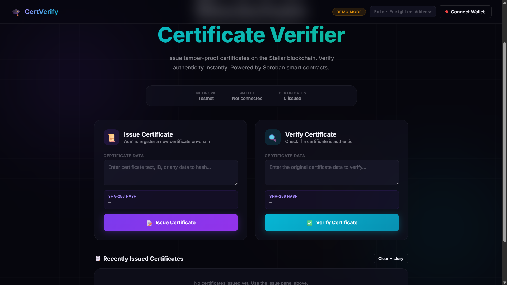
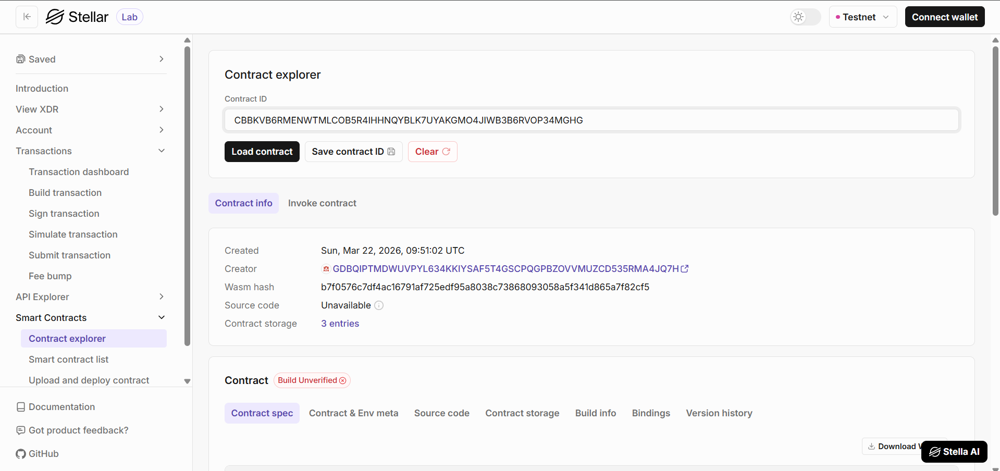

# 🎓 Certificate Verifier 🔐

A fully functional, decentralized Web3 application built on the Stellar Soroban blockchain. This dApp allows institutions to issue tamper-proof certificates on-chain and lets anyone verify their authenticity instantly.

## Deployment Details

*   **Contract ID / Address:** `CBBKVB6RMENWTMLCOB5R4IHHNQYBLK7UYAKGMO4JIWB3B6RVOP34MGHG`
*   **Network:** Stellar Testnet
*   **Deployment Link:** `[Insert Deployment URL Here]`

## Dashboard Preview



---

## Stellar Labs



---

## Features ✨

*   **On-Chain Certificate Registry:** Admin/issuers can register SHA-256 certificate hashes directly on the Stellar blockchain, making them immutable and publicly auditable.
*   **Instant Verification:** Anyone can verify a certificate's authenticity by submitting its hash — the contract returns `true` if valid, `false` otherwise.
*   **Non-Custodial Wallet Integration:** Securely connect and sign transactions using the [Freighter Browser Extension](https://www.freighter.app/).
*   **Demo Mode:** Supports localStorage-based demo mode for testing without a live wallet.
*   **Fraud-Proof:** Because hashes are stored on the Soroban ledger, no one can alter or forge a certificate once it's registered.

## Project Architecture 🏗️

The project is divided into two main components:

1.  **Smart Contract (`/contract`)**: Written in Rust using the Soroban SDK. It handles admin initialization, certificate registration, and hash-based verification.
2.  **Frontend (`/frontend`)**: A Web3 frontend (`index.html` + `app.js`) that interacts with the deployed contract on the Soroban Testnet via Freighter wallet.

---

## Getting Started 🚀

### Prerequisites

*   [Node.js](https://nodejs.org/) (v18+)
*   [Rust](https://www.rust-lang.org/) (v1.70+)
*   [Stellar CLI](https://developers.stellar.org/docs/build/smart-contracts/getting-started/setup)
*   [Freighter Wallet Extension](https://www.freighter.app/)

### 1. Smart Contract (Phase A)

The contract is already deployed to the Stellar Testnet at the address above. To deploy it yourself:

1. Build the contract:
   ```bash
   stellar contract build
   ```
   Or manually:
   ```bash
   cargo build --target wasm32-unknown-unknown --release
   ```
   Output: `target/wasm32-unknown-unknown/release/certificate_verifier.wasm`

2. Run unit tests:
   ```bash
   cargo test
   ```

3. Deploy to Testnet:
   ```bash
   stellar contract deploy \
     --wasm target/wasm32-unknown-unknown/release/certificate_verifier.wasm \
     --source <YOUR_SECRET_KEY> \
     --network testnet
   ```

4. Initialize the contract (set admin):
   ```bash
   stellar contract invoke \
     --id CBBKVB6RMENWTMLCOB5R4IHHNQYBLK7UYAKGMO4JIWB3B6RVOP34MGHG \
     --source <YOUR_SECRET_KEY> \
     --network testnet \
     -- initialize \
     --admin <ADMIN_PUBLIC_KEY>
   ```

5. Add a certificate:
   ```bash
   stellar contract invoke \
     --id CBBKVB6RMENWTMLCOB5R4IHHNQYBLK7UYAKGMO4JIWB3B6RVOP34MGHG \
     --source <ADMIN_SECRET_KEY> \
     --network testnet \
     -- add_certificate \
     --admin <ADMIN_PUBLIC_KEY> \
     --hash <32_BYTE_HEX_HASH>
   ```

6. Verify a certificate:
   ```bash
   stellar contract invoke \
     --id CBBKVB6RMENWTMLCOB5R4IHHNQYBLK7UYAKGMO4JIWB3B6RVOP34MGHG \
     --network testnet \
     -- verify_certificate \
     --hash <32_BYTE_HEX_HASH>
   ```
   Returns `true` if valid, `false` otherwise.

### 2. Frontend Application (Phase B)

1. Navigate to the frontend directory:
   ```bash
   cd frontend
   ```
2. Install dependencies (if you haven't already):
   ```bash
   npm install
   ```
3. Run the Next.js development server:
   ```bash
   npm run dev
   ```
4. Open `http://localhost:3000` in your browser.
5. Supports **Demo Mode** (localStorage) and **Freighter wallet** for live testnet interaction.

### Connecting your Wallet

1. Install the Freighter extension.
2. Switch the Freighter network to **Testnet**.
3. Fund your Freighter wallet using the [Stellar Laboratory Friendbot](https://laboratory.stellar.org/#account-creator?network=test).
4. Click **CONNECT FREIGHTER** in the top right corner of the dApp.

## Contract API 📋

| Function | Who Can Call | Description |
|---|---|---|
| `initialize(admin)` | Anyone (once) | Set the admin/issuer address |
| `add_certificate(admin, hash)` | Admin only | Register a certificate hash (BytesN<32>) |
| `verify_certificate(hash)` | Anyone | Returns `true` if the certificate exists |
